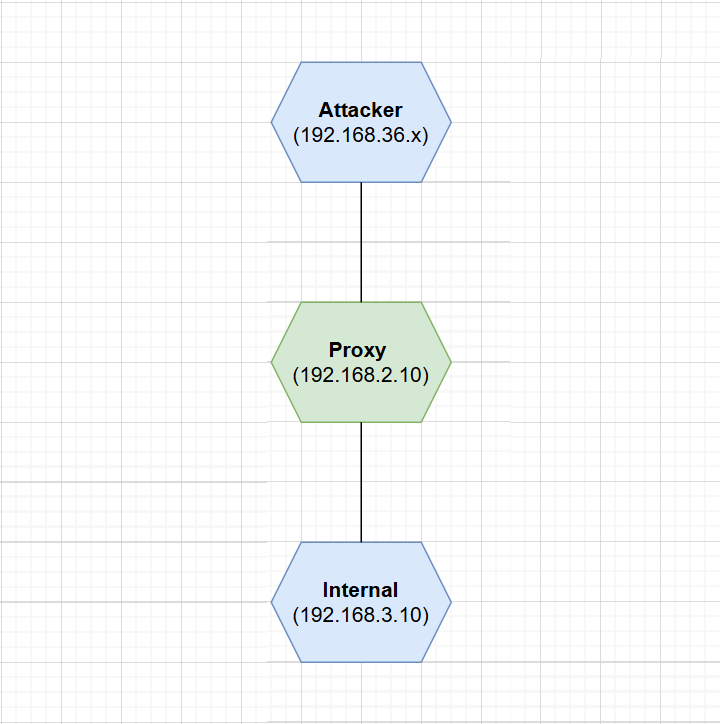

# Three-Tier-Network-Attack-Lab

A self-built enterprise-style three-tier penetration testing lab.

This project simulates a realistic attack path:

External Attacker → Jump Host (Proxy) → Isolated Internal Target

It demonstrates how network segmentation, NAT, firewall rules, and vulnerable services interact in a controlled offensive security lab.

---

## 🏗 Architecture Overview

### Network Segments

- Attacker Machine (Kali) – 192.168.36.x
- Proxy / Jump Host – 192.168.2.10
- Internal Target – 192.168.3.10

### Isolation Design

- Attacker cannot directly access internal network
- Proxy acts as NAT gateway and firewall
- Internal machine has no internet access
- Traffic strictly controlled via iptables

---

## 🔥 Vulnerabilities Implemented

### Proxy Machine

- Weak password SSH (student / students)
- Redis unauthorized access (no authentication)

### Internal Machine

- Vulnerable Flask Web Application
  - SSTI (Server-Side Template Injection)
  - Arbitrary File Read
  - Remote Command Execution (RCE)

---

## ⚔ Attack Flow

1. Brute-force SSH → Gain proxy access
2. Abuse Redis misconfiguration
3. Port forwarding via socat
4. Exploit Flask SSTI
5. Achieve RCE
6. Capture internal flag

---

## 🛠 Key Technical Skills Demonstrated

- Linux network routing
- Static IP & persistent configuration
- NAT (SNAT via iptables)
- Firewall rule design (INPUT / FORWARD chains)
- Service persistence via systemd
- Offline dependency installation (Flask)
- Exploitation of Redis misconfiguration
- SSTI to RCE exploitation chain

---

## 📂 Project Structure

Three-Tier-Network-Attack-Lab/
 │
 ├── README.md
 ├── docs/
 │   ├── architecture.md
 │   ├── environment-setup.md
 │   ├── network-isolation.md
 │   ├── vulnerability-design.md
 │   └── attack-walkthrough.md
 │
 ├── vulns/
 │   └── flask-app/
 │       └── app.py
 │
 ├── images/
 │
 └── vm-download.md

---

## 🚀 How to Reproduce

1. Download VM images (see vm-download.md)
2. Configure network interfaces
3. Apply routing & firewall rules
4. Start vulnerable services
5. Follow attack walkthrough in docs/

---

## 🎯 Learning Outcome

This lab helps learners understand:

- How multi-segment enterprise networks are structured
- How network isolation is implemented in practice
- How attackers pivot from DMZ to internal network
- How web vulnerabilities lead to full compromise

---

## ⚠ Disclaimer

This project is for educational and research purposes only.
Do not deploy in production environments.

